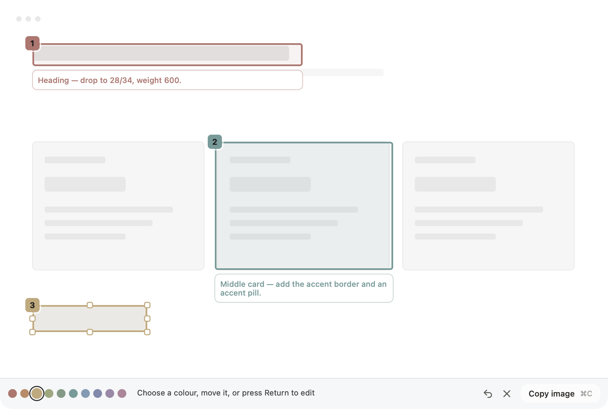
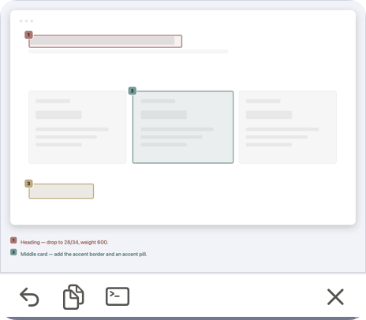

# Fetcher Screenshots App

A macOS screenshot tool for designers who build with AI.

Drag a box around the part of the UI that is wrong, type what should change,
press Return. The export carries both halves at once: the marked-up image and a
numbered instruction list the model can read. The screenshot is the evidence,
the list is the task, and they never drift apart.

Fetcher is built for the review loop between Figma and an AI coding assistant.
It feeds Cursor, Claude Code and Codex directly: every capture is copied to the
clipboard *and* written to disk, because terminal-first tools want a file path,
not a paste.



## Why it exists

Visual critique loses precision the moment it becomes plain text. "The heading
is too heavy" does not say which heading, how heavy, or where the reviewer was
looking. Fetcher keeps the pixels and the sentence together:

- Capture only the region that matters, snapped to the frame under the pointer.
- Mark each issue with a colored, numbered box and a short note.
- Export one artifact: the annotated PNG plus a legend and prompt text.
- Hand that artifact to the next build pass as image evidence *and* task list.

## What it demonstrates

- A tool designed for a repeated loop rather than a one-off screenshot.
- Keyboard-first annotation with visible controls, so the fast path is also the
  discoverable path.
- A compositor that is a pure function of image, annotations and options. The
  editor canvas draws with the *same* code at a different scale, so the preview
  is the export by construction.
- Native macOS behaviour throughout: ScreenCaptureKit capture, SF Symbols, menu
  bar residency, launch at login.
- A quiet Pearl Flowglass interface aligned with the shared studio system, so
  the capture stays the loudest thing on screen.

## The loop

1. Press `⌃⌘C`. The screen freezes and a crosshair appears. Hover a card or a
   Figma frame to outline it, then click or press `⏎` to take it, or drag your
   own region.
2. Drag a box in the editor. The caret is already in the note field.
3. Type what is wrong. `⏎` commits the note and arms the next box.
4. `⌘C` copies the export. `⌘S` saves it and copies the file path.

A capture nobody marks up is a plain screenshot: left untouched for three
seconds it copies itself and moves to a corner card with Copy, Copy path,
Back-to-editing and drag-out. Both timings live in Settings.



## The export

The capture sits inset on a ground with a soft shadow, and the numbered notes
are listed below it. In dark mode the shadow becomes a light halo. The prompt
text names each note by number and color, so the model can quote a line back.

Turn the inset off under Export for pixel-exact screenshots.

Two things are deliberately not configurable, because they are what makes the
output trustworthy: the order colors are handed out in, and the numbering that
ties each badge to its line of text. Color names in the prompt are derived from
the color itself, so recoloring a slot can never make the prompt lie.

## Shortcuts

| Key | Where | Action |
| --- | --- | --- |
| `⌃⌘C` | global | Capture a region |
| `⌃⌘X` | global | Re-capture the last region, straight to the editor |
| `⏎` | crosshair | Take the outlined frame under the pointer |
| drag | editor | New box, next color, next number, caret armed |
| `⏎` / `⇧⏎` | note field | Commit / newline |
| `⇥` / `⇧⇥` | note field | Commit and edit the next / previous note |
| `⌥1`–`⌥0` | note field | Recolor while typing |
| `1`–`0` | canvas | Recolor the selection |
| `⌫` | canvas | Delete the selection and renumber |
| arrows | canvas | Nudge 1px · `⌥` resize · `⇧` ×10 |
| `⌘Z` / `⇧⌘Z` | canvas | Undo / redo |
| `⌘C` / `⌘⏎` | canvas | Copy the export |
| `⌥⌘C` | canvas | Copy the prompt text only |
| `⌘S` | canvas | Save and copy the file path |
| `esc` | anywhere | Revert, deselect, then cancel |
| `⌘,` | menu bar | Settings |

The global shortcuts use the control variants because nothing standard claims
them: `⌘C`, `⇧⌘C` and `⌥⌘C` are all taken inside Figma. Both can be rebound in
Settings. Hold `⌥` while the crosshair is up to turn frame snapping off.

## Install and build

Requires macOS 14 or later and the Xcode Command Line Tools. No Xcode project.

```bash
./scripts/build-app.sh release
```

This produces `dist/Fetcher.app`. Open it once; it lives in the menu bar with
no Dock icon and no window until you press the shortcut.

### Screen Recording permission

macOS grants Screen Recording to a signed bundle identity, so always run the
`.app`, never the bare binary. The build script ad-hoc signs the bundle, and an
ad-hoc signature includes the code hash, so a rebuild can invalidate the grant
and macOS will ask again. Signing with a Developer ID makes it stick:

```bash
codesign --force --sign "Developer ID Application: YOUR NAME (TEAMID)" \
  --identifier com.fetcher.Fetcher dist/Fetcher.app
```

When the grant goes stale the app says so directly instead of reporting that no
displays were found.

## Settings

`⌘,` from the menu bar: shortcuts, frame snapping, legend on/off and position,
the inset, 1× export, save folder, the ten colors, the prompt template, and
launch at login.

## Interface system

Fetcher uses the Pearl Flowglass token set shared across Yanice Yang's studio
tools: pearl surfaces, a single dark ink, large working radii, and one fast,
reversible motion curve. The tokens arrive as a generated Swift file, and the
source version is recorded in `YY_STUDIO_SYSTEM_VERSION`. The capture workflow
stays native to macOS; the shared system only aligns material, spacing and
feedback.

## Testing

```bash
swift build
./.build/debug/Fetcher --selftest      # model, prompt, compositor, capture
./.build/debug/Fetcher --e2e           # synthetic events through the real views
./.build/debug/Fetcher --editor-demo   # writes UI state PNGs to dist/
```

The self-test runs in two tiers. Model, prompt and compositor checks need no
permission and no display. The capture checks need Screen Recording, which only
a person can grant, so a missing grant blocks that leg rather than the suite.

Compositor checks sample pixels rather than only measuring dimensions, because
a vertically mirrored export once passed every size check. The end-to-end run
drives the real event handlers with synthetic `NSEvent`s in-process: draw a
box, type, commit, copy, then inspect the clipboard and the file on disk.

What still needs a person: the Screen Recording dialog, whether a drag lands in
Figma or Cursor, and whether the loop feels fast.

## Layout

```
Sources/Fetcher/
  Capture/    ScreenCaptureKit freeze, region overlay, frame detection
  Model/      Annotation, MarkupDocument (snapshot undo), Palette
  Editor/     Canvas state machine, note field, toolbar, corner card, motion
  Output/     Compositor (pure), prompt template, clipboard and disk
  Settings/   Preferences, hotkey recorder, launch at login
```

## Status

Version 0.1.0. Capture, annotation, export, settings and multi-display support
are implemented. A selection spanning two displays is not supported. Distribution
is source-only for now; there is no notarized build.

## Licence

MIT — see [LICENSE](LICENSE).
